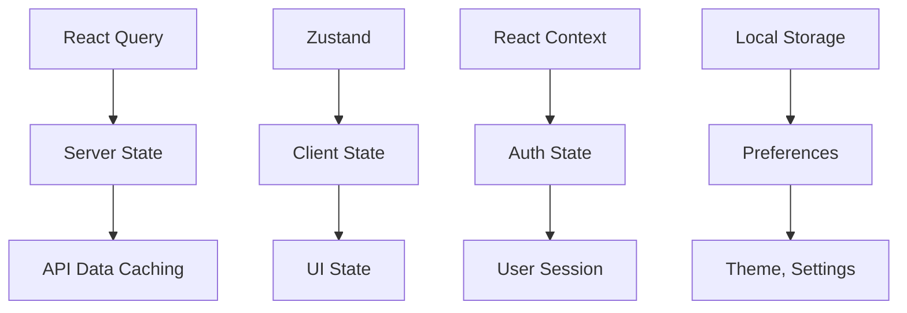

# 🔗 LinkShort - Professional URL Shortener Frontend

[](https://nextjs.org/)
[](https://reactjs.org/)
[](https://www.typescriptlang.org/)
[](https://tailwindcss.com/)
[](https://ui.shadcn.com/)
[](https://opensource.org/licenses/MIT)

> **Modern, professional URL shortening platform with advanced analytics, custom domains, and enterprise-grade security.**


## ✨ Features

### 🎯 **Core Functionality**
- **Smart URL Shortening** - Transform long URLs into branded short links
- **Custom Short Codes** - Create memorable, branded links
- **QR Code Generation** - Automatic QR codes for every link
- **Bulk Operations** - Manage hundreds of links efficiently
- **Link Expiration** - Set automatic expiry dates

### 📊 **Advanced Analytics**
- **Real-time Tracking** - Monitor clicks as they happen
- **Geographic Insights** - See where your audience is located
- **Device Analytics** - Desktop, mobile, and tablet breakdown
- **Referrer Analysis** - Track traffic sources
- **Time Series Data** - Historical performance trends
- **Export Capabilities** - Download data in CSV/JSON

### 🎨 **Modern Experience**
- **Responsive Design** - Perfect on all devices
- **Dark/Light Mode** - System preference detection
- **Lightning Fast** - Sub-100ms redirect times
- **Accessible** - WCAG 2.1 compliant
- **Progressive Web App** - Installable experience

### 🔒 **Enterprise Security**
- **JWT Authentication** - Secure token-based auth
- **Password Protection** - Secure sensitive links
- **Access Controls** - Team permissions management
- **Audit Logs** - Track all actions
- **GDPR Compliant** - Privacy-first approach

## 🚀 Quick Start

### Prerequisites

- **Node.js** 18+ 
- **npm/yarn/pnpm**
- **Backend API** (see [backend repository](https://github.com/Siela25/urlshortener-backend))

### Installation

```bash
# 1. Clone the repository
git clone https://github.com/yourusername/linkshort-frontend.git
cd linkshort-frontend

# 2. Install dependencies
npm install

# 3. Configure environment
cp .env.example .env.local
# Edit .env.local with your settings

# 4. Start development server
npm run dev
```

### Environment Variables

Create `.env.local` in the root directory:

```bash
# API Configuration
NEXT_PUBLIC_API_URL=http://localhost:8080
NEXT_PUBLIC_APP_URL=http://localhost:3000

# Feature Flags
NEXT_PUBLIC_ENABLE_QUERY_DEVTOOLS=true
NEXT_PUBLIC_ENABLE_QR_CODES=true
NEXT_PUBLIC_ENABLE_CUSTOM_DOMAINS=false

# Rate Limiting
NEXT_PUBLIC_MAX_URL_LENGTH=2048
```

## 🏗️ Architecture

### Tech Stack

| Category | Technology | Version | Purpose |
|----------|------------|---------|---------|
| **Framework** | Next.js | 15.3+ | React framework with App Router |
| **UI Library** | React | 19+ | User interface |
| **Language** | TypeScript | 5+ | Type safety |
| **Styling** | Tailwind CSS | 4+ | Utility-first CSS |
| **Components** | shadcn/ui | Latest | Beautiful, accessible components |
| **State Management** | Zustand | 5+ | Lightweight state management |
| **Server State** | React Query | 5+ | Data fetching and caching |
| **Forms** | React Hook Form | 7+ | Form handling |
| **Validation** | Zod | 3+ | Schema validation |
| **HTTP Client** | Axios | 1+ | API communication |
| **Charts** | Recharts | 2+ | Data visualization |

### Project Structure

```
src/
├── app/                          # Next.js App Router
│   ├── (auth)/                   # Authentication routes
│   │   ├── login/page.tsx
│   │   ├── register/page.tsx
│   │   └── layout.tsx
│   ├── (dashboard)/              # Protected routes
│   │   ├── dashboard/page.tsx
│   │   ├── analytics/[id]/page.tsx
│   │   └── layout.tsx
│   ├── api/                      # API routes (proxy)
│   ├── [shortCode]/page.tsx      # Dynamic redirect handling
│   ├── globals.css
│   ├── layout.tsx
│   └── page.tsx                  # Landing page
│
├── components/                   # React components
│   ├── ui/                       # shadcn/ui components
│   │   ├── button.tsx
│   │   ├── input.tsx
│   │   ├── card.tsx
│   │   └── ...
│   ├── forms/                    # Form components
│   │   ├── login-form.tsx
│   │   ├── register-form.tsx
│   │   └── link-form.tsx
│   ├── dashboard/                # Dashboard components
│   │   ├── link-card.tsx
│   │   ├── stats-overview.tsx
│   │   └── ...
│   ├── analytics/                # Analytics components
│   │   ├── clicks-chart.tsx
│   │   ├── geographic-map.tsx
│   │   └── ...
│   ├── layout/                   # Layout components
│   │   ├── header.tsx
│   │   ├── sidebar.tsx
│   │   └── ...
│   ├── providers/                # React contexts
│   │   ├── auth-provider.tsx
│   │   ├── query-provider.tsx
│   │   └── theme-provider.tsx
│   ├── common/                   # Shared components
│   └── landing/                  # Landing page components
│       ├── hero.tsx
│       ├── features.tsx
│       ├── quick-shorten.tsx
│       ├── testimonials.tsx
│       └── pricing.tsx
│
├── hooks/                        # Custom React hooks
│   ├── use-auth.ts
│   ├── use-links.ts
│   ├── use-analytics.ts
│   ├── use-debounce.ts
│   ├── use-copy-to-clipboard.ts
│   └── use-media-query.ts
│
├── lib/                          # Utilities and configuration
│   ├── api.ts                    # API client with interceptors
│   ├── auth.ts                   # Authentication utilities
│   ├── store.ts                  # Zustand stores
│   ├── utils.ts                  # General utilities
│   ├── validators.ts             # Zod schemas
│   ├── constants.ts              # App constants
│   └── query-client.ts           # React Query configuration
│
├── types/                        # TypeScript definitions
│   ├── auth.ts
│   ├── links.ts
│   ├── analytics.ts
│   ├── api.ts
│   └── global.ts
│
└── middleware.ts                 # Next.js middleware
```

### State Management



## 🎨 Components

### Landing Page

#### Hero Section
```tsx
// Modern hero with gradient backgrounds and animations
<Hero />
```

#### Quick Shorten Demo
```tsx
// Interactive URL shortening without registration
<QuickShorten />
```

#### Features Showcase
```tsx
// Animated feature cards with icons
<Features />
```

### Authentication

#### Protected Routes
```tsx
// Middleware-protected dashboard routes
middleware.ts
```

#### Auth Forms
```tsx
// Validated forms with error handling
<LoginForm />
<RegisterForm />
```

### UI Components

All components built with **shadcn/ui** for consistency:

```tsx
// Modern, accessible components
<Button variant="default" size="lg" />
<Input placeholder="Enter URL..." />
<Card className="glass-effect" />
```

## 📱 Responsive Design

### Breakpoints

| Breakpoint | Width | Device |
|------------|-------|--------|
| `xs` | < 640px | Mobile Portrait |
| `sm` | 640px+ | Mobile Landscape |
| `md` | 768px+ | Tablet |
| `lg` | 1024px+ | Desktop |
| `xl` | 1280px+ | Large Desktop |
| `2xl` | 1536px+ | Extra Large |

### Mobile-First Approach

```css
/* Mobile-first responsive utilities */
.container-custom {
  @apply max-w-7xl mx-auto px-4 sm:px-6 lg:px-8;
}

.section-padding {
  @apply py-12 md:py-16 lg:py-20;
}
```

## 🔌 API Integration

### Authentication Flow

```typescript
// JWT-based authentication with automatic token refresh
const authFlow = {
  login: 'POST /api/auth/login',
  register: 'POST /api/auth/register', 
  refresh: 'POST /api/auth/refresh',
  logout: 'DELETE /api/auth/logout'
}
```

### Link Management

```typescript
// CRUD operations for URL management
const linkAPI = {
  create: 'POST /api/links',
  list: 'GET /api/links',
  update: 'PUT /api/links/:id',
  delete: 'DELETE /api/links/:id',
  bulk: 'POST /api/links/bulk'
}
```

### Analytics

```typescript
// Detailed analytics endpoints
const analyticsAPI = {
  overview: 'GET /api/analytics/:id/overview',
  clicks: 'GET /api/analytics/:id/clicks',
  geographic: 'GET /api/analytics/:id/geographic',
  devices: 'GET /api/analytics/:id/devices',
  referrers: 'GET /api/analytics/:id/referrers',
  export: 'GET /api/analytics/:id/export'
}
```

### Error Handling

```typescript
// Centralized error handling with user-friendly messages
const apiClient = {
  interceptors: {
    response: handleErrors,
    request: addAuthHeaders
  }
}
```

## 🧪 Testing

### Unit Tests

```bash
# Run unit tests
npm run test

# Run with coverage
npm run test:coverage

# Watch mode
npm run test:watch
```

### E2E Tests

```bash
# Run Playwright tests
npm run test:e2e

# Run specific test
npm run test:e2e -- --grep "login flow"
```

### Type Checking

```bash
# TypeScript type checking
npm run type-check

# Build check
npm run build
```

## 🚀 Deployment

### Vercel (Recommended)

```bash
# Install Vercel CLI
npm i -g vercel

# Deploy
vercel --prod
```

### Docker

```dockerfile
# Production Dockerfile
FROM node:18-alpine AS builder
WORKDIR /app
COPY package*.json ./
RUN npm ci --only=production
COPY . .
RUN npm run build

FROM node:18-alpine AS runner
WORKDIR /app
COPY --from=builder /app/next.config.js ./
COPY --from=builder /app/public ./public
COPY --from=builder /app/.next ./.next
COPY --from=builder /app/node_modules ./node_modules
COPY --from=builder /app/package.json ./package.json

EXPOSE 3000
CMD ["npm", "start"]
```

### Environment-Specific Configs

#### Production
```bash
NEXT_PUBLIC_API_URL=https://api.linkshort.com
NEXT_PUBLIC_APP_URL=https://linkshort.com
NEXT_PUBLIC_ENABLE_QUERY_DEVTOOLS=false
```

#### Staging
```bash
NEXT_PUBLIC_API_URL=https://staging-api.linkshort.com
NEXT_PUBLIC_APP_URL=https://staging.linkshort.com
```

## 🔧 Development

### Code Style

```bash
# Linting
npm run lint

# Formatting
npm run format

# Pre-commit hooks
npm run pre-commit
```

### Adding Features

1. **Create types** in `src/types/`
2. **Add API methods** in `src/lib/api.ts`
3. **Create components** in `src/components/`
4. **Add routes** in `src/app/`
5. **Write tests**

### Custom Hooks

```typescript
// Example: Custom hook for link management
export function useLinks() {
  const { data, isLoading } = useQuery({
    queryKey: ['links'],
    queryFn: () => apiClient.get('/api/links')
  });
  
  return { links: data, isLoading };
}
```

## 📊 Performance

### Core Web Vitals

- **LCP**: < 2.5s
- **FID**: < 100ms  
- **CLS**: < 0.1

### Optimizations

- **Code Splitting** - Route-based chunks
- **Image Optimization** - Next.js Image component
- **Bundle Analysis** - `npm run analyze`
- **Caching** - React Query with stale-while-revalidate
- **Compression** - gzip/brotli enabled

### Monitoring

```typescript
// Performance monitoring
export function reportWebVitals(metric) {
  // Send to analytics service
  analytics.track('Web Vitals', metric);
}
```

## 🌍 Internationalization

### Setup (Future Enhancement)

```typescript
// i18n configuration
const i18nConfig = {
  locales: ['en', 'es', 'fr', 'de'],
  defaultLocale: 'en',
  domains: [
    { domain: 'linkshort.com', defaultLocale: 'en' },
    { domain: 'linkshort.es', defaultLocale: 'es' }
  ]
}
```

## 🔒 Security

### Security Headers

```typescript
// Next.js middleware security headers
const securityHeaders = [
  'X-Content-Type-Options: nosniff',
  'X-Frame-Options: DENY', 
  'X-XSS-Protection: 1; mode=block',
  'Referrer-Policy: strict-origin-when-cross-origin'
]
```

### Authentication

- **JWT Tokens** - Secure, stateless authentication
- **Automatic Refresh** - Seamless token renewal
- **Protected Routes** - Middleware-based protection
- **CSRF Protection** - Built-in Next.js protection

## 🤝 Contributing

### Development Setup

1. **Fork** the repository
2. **Clone** your fork: `git clone https://github.com/YOUR_USERNAME/linkshort-frontend.git`
3. **Create branch**: `git checkout -b feature/amazing-feature`
4. **Install dependencies**: `npm install`
5. **Start development**: `npm run dev`

### Coding Standards

- **TypeScript** - Strict mode enabled
- **ESLint** - Airbnb configuration
- **Prettier** - Code formatting
- **Conventional Commits** - Commit message format

### Pull Request Process

1. **Update documentation** for any new features
2. **Add tests** for new functionality
3. **Ensure CI passes** - all tests and checks
4. **Request review** from maintainers

## 📈 Roadmap

### Version 1.1 - Enhanced Analytics
- [ ] Real-time analytics dashboard
- [ ] Geographic heat maps
- [ ] A/B testing for links
- [ ] Custom event tracking

### Version 1.2 - Advanced Features
- [ ] Team collaboration
- [ ] Webhook notifications
- [ ] Advanced API features
- [ ] Mobile app

### Version 2.0 - Enterprise
- [ ] White-label solution
- [ ] SSO integration
- [ ] Advanced security features
- [ ] Multi-region deployment

## 📄 License

This project is licensed under the MIT License - see the [LICENSE](LICENSE) file for details.

```
MIT License

Copyright (c) 2025 LinkShort

Permission is hereby granted, free of charge, to any person obtaining a copy
of this software and associated documentation files (the "Software"), to deal
in the Software without restriction, including without limitation the rights
to use, copy, modify, merge, publish, distribute, sublicense, and/or sell
copies of the Software, and to permit persons to whom the Software is
furnished to do so, subject to the following conditions:

The above copyright notice and this permission notice shall be included in all
copies or substantial portions of the Software.

THE SOFTWARE IS PROVIDED "AS IS", WITHOUT WARRANTY OF ANY KIND, EXPRESS OR
IMPLIED, INCLUDING BUT NOT LIMITED TO THE WARRANTIES OF MERCHANTABILITY,
FITNESS FOR A PARTICULAR PURPOSE AND NONINFRINGEMENT. IN NO EVENT SHALL THE
AUTHORS OR COPYRIGHT HOLDERS BE LIABLE FOR ANY CLAIM, DAMAGES OR OTHER
LIABILITY, WHETHER IN AN ACTION OF CONTRACT, TORT OR OTHERWISE, ARISING FROM,
OUT OF OR IN CONNECTION WITH THE SOFTWARE OR THE USE OR OTHER DEALINGS IN THE
SOFTWARE.
```

## 🙏 Acknowledgments

- [Next.js](https://nextjs.org/) - The React Framework for Production
- [shadcn/ui](https://ui.shadcn.com/) - Beautiful and accessible components
- [Tailwind CSS](https://tailwindcss.com/) - Utility-first CSS framework
- [React Query](https://tanstack.com/query) - Powerful data synchronization
- [Zustand](https://github.com/pmndrs/zustand) - Lightweight state management
